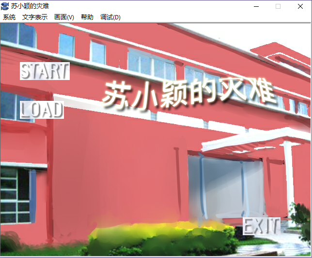

# krkrgame
This is a traditional text-based AVG game implemented by krkr engine.

krkr engine is a text-based engine and what I set macros at the start of engine file to define text size, text font, text speed etc.

Then, I write different files to include the actual texts, music and images in different scenes after different options 

that player chooses.

Starting scene:

Normal Scene:

Option Scene:

The actual game can be downloaded in the following link since the file is too big to upload in github.
https://drive.google.com/open?id=0B6FujGNUswmfc1NWYVBBRVJkTnM

